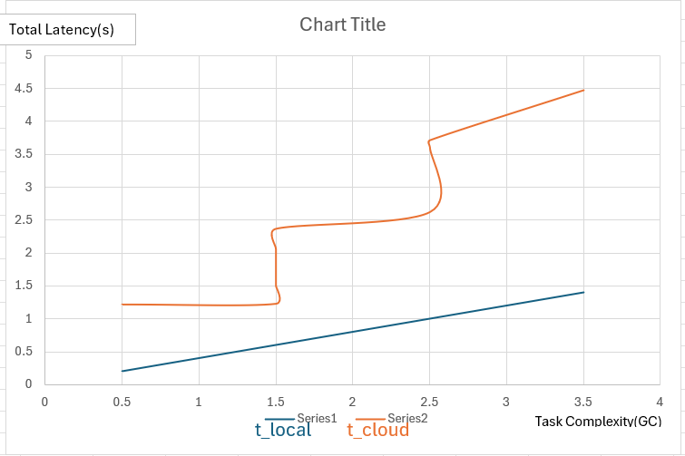

# Fog-Latency-Simulator

A discrete-event simulator written in **C** designed to model task offloading decisions between a local Fog node and a centralized Cloud server.

## Overview

In modern IoT ecosystems, processing every piece of data in the Cloud introduces significant latency. This simulator models a decision engine that chooses the optimal processing path based on real-time computational constraints and network conditions.

1. **Process Locally:** The Fog node handles tasks with low complexity to avoid network delays.
2. **Offload to Cloud:** High-complexity tasks are sent to the Cloud to leverage superior processing speeds, despite the transmission penalty.

## Mathematical Model

The simulation determines the efficiency of the system by calculating the total latency ($L$) for each task.

### 1. Fog Computing Latency ($t_{local}$)
Local latency is a deterministic value based on the processing capacity of the Fog node.

$$t_{local} = \frac{C}{S_{fog}}$$

Where:
* $C$: Task Complexity (GigaCycles)
* $S_{fog}$: CPU Speed of the Fog node (GHz)

### 2. Cloud Computing Latency ($t_{cloud}$)
Cloud latency is a stochastic value that accounts for the "Internet Tax" and variable transmission times.

$$t_{cloud} = d_{prop} + \left( \frac{D}{B} \right) + \frac{C}{S_{cloud}}$$

Where:
* $d_{prop}$: Propagation Delay (Fixed travel time)
* $D$: Data Size of the task (Megabits)
* $B$: Network Bandwidth (Mbps)
* $S_{cloud}$: CPU Speed of the Cloud server (GHz)

## Key Technical Features

* **Memory Management:** Utilizes dynamic memory allocation (`malloc`) and `struct` pointers to manage task queues.
* **Stochastic Modeling:** Implements random data size and complexity generation to simulate real-world network unpredictability.
* **Deterministic Scheduling:** Tasks are generated at a fixed **0.2s interval** to stress-test the Fog node's processing threshold.
* **Data Persistence:** Automatically exports simulation results to a `.csv` format for external data visualization and analysis.

## Performance Analysis


* **The Fog Line** (Series 1) remains a clean linear ramp.
* **The Cloud Line** (Series 2) exhibits vertical jitter, representing the impact of variable data transmission on network-bound tasks.

## Real-World Use Cases

The simulator models the decision-making process required in low-latency environments where centralized processing is insufficient.

* **Autonomous Vehicles:** Safety-critical tasks requiring response times where $t < 10ms$ are processed at the Fog level to prevent collisions.
* **Smart Cities:** Local nodes aggregate high-volume sensor data from traffic lights and utilities, reducing core network bandwidth consumption.
* **Industrial IoT:** Predictive maintenance and emergency shutdowns are executed locally to ensure system autonomy during network instability.
* **Smart Healthcare:** Real-time biometric monitoring for emergency alerts is handled locally to ensure privacy and immediate responsiveness.

## References

* **Cisco White Paper:** "Fog Computing and the Internet of Things: Extend the Cloud to Where the Things Are," Cisco Systems, Inc.
* **NPTEL Lecture Series:** "Introduction to Internet of Things," Prof. Sudip Misra, Department of Computer Science and Engineering, Indian Institute of Technology (IIT) Kharagpur.

## Getting Started

### Prerequisites
* GCC Compiler
* Standard C Libraries (`stdio.h`, `stdlib.h`, `time.h`)

### Compilation
```bash
gcc main.c -o FogSim
./FogSim

